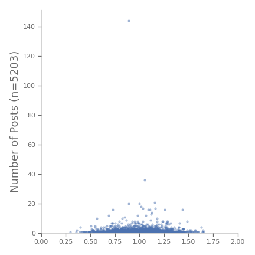
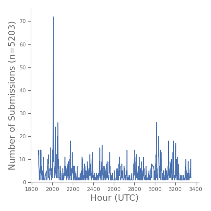
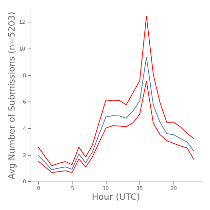
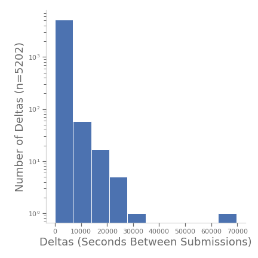
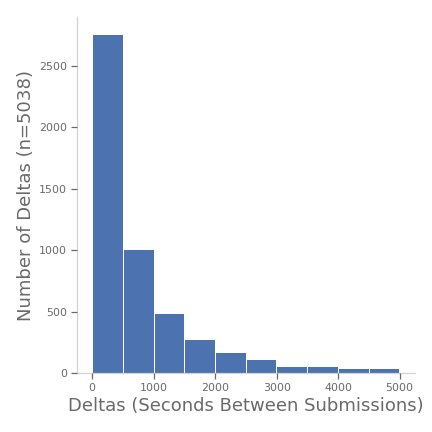

# WSBAnalysis
An analysis of posts on r/WallStreetBets

# Background
In the January 2021, a large group of individual investors held together by an online forums (r/WallStreetBets) pushed a stock (GME) from a modest $17/share to $347/share. This was considered noteworthy because a) institutional investors had signaled the company was overvalued and were shorting it and b) those institutional investors lost a significant amount of money, with one allegedly going bankrupt.

See also [Building an algorithmic trading strategy with r/wallstreetbets discussion data](https://www.reddit.com/r/algotrading/comments/lmtp17/building_an_algorithmic_trading_strategy_with/)

Hence, the structure of this online community is worthy of investigation because of its ability to steer the behavior of a large number of invidivual investors in a way that negates contrary messaging of top-down institutional decision makers and actors. With that in mind, the purpose of this investigation is to gain an understanding of the structure of the online community, how it communicates about stock, how messages about stocks disseminate and maintain in the discourse, and so on.


# The Data

As of 04/03/21, the dataset consisted of 1857 submissions to r/WallStreetBets from 03/18/21 to 04/03/21. These were scraped using the Reddit API and a tool I developed, [WSBScraper](https://github.com/AndrewSamaha/WSBScraper), which saves posts to a MongoDB.

A Sample:
```
{ 
    "_id" : ObjectId("605bb15d5df7eedfb49c1b8d"), 
    "id" : "mchdcf", 
    "fullname" : "t3_mchdcf", 
    "selftext" : "", 
    "created_utc" : "2021-03-24 17:36:29", 
    "num_comments" : 2, 
    "score" : 7, 
    "upvote_ratio" : 1, 
    "is_original_content" : false, 
    "permalink" : "/r/wallstreetbets/comments/mchdcf/im_an_abe_and_i_eat_crayons_keeping_those_gme/", 
    "title" : "I’m an abe 🦍 and I eat crayons 🖍 Keeping those GME contracts because selling is a loss all in its own! 17K down and still holding strong!", 
    "author" : "Powerful-Ad812", 
    "firstseen" : "2021-03-24 21:38:37.008913" 
}
```

# The authors
A total of 1408 submission authors are represented in the data. The plot below shows a histogram of the authors ranked from most to lease posts. Note the vast majority of posters only posted once during the time period. Conversely, a minority of posters contributed 6 or more posts.



<Figure size 432x432 with 1 Axes><Figure size 432x432 with 1 Axes><Figure size 432x432 with 1 Axes>

| Poster | Post Count |
|--------|------------|
| <a href=https://www.reddit.com/user/OPINION_IS_UNPOPULAR/>OPINION_IS_UNPOPULAR</a> | 49 |
| <a href=https://www.reddit.com/user/disgruntledbkbum/>disgruntledbkbum</a> | 18 |
| <a href=https://www.reddit.com/user/pdwp90/>pdwp90</a> | 12 |
| <a href=https://www.reddit.com/user/CMScientist/>CMScientist</a> | 10 |
| <a href=https://www.reddit.com/user/Jesus_Gains_Christ/>Jesus_Gains_Christ</a> | 10 |
| <a href=https://www.reddit.com/user/AutoModerator/>AutoModerator</a> | 10 |
| <a href=https://www.reddit.com/user/Citor3_scenes/>Citor3_scenes</a> | 8 |
| <a href=https://www.reddit.com/user/GrubbyWango/>GrubbyWango</a> | 8 |
| <a href=https://www.reddit.com/user/dvdgelman7/>dvdgelman7</a> | 8 |
| <a href=https://www.reddit.com/user/DanyeelsAnulmint/>DanyeelsAnulmint</a> | 7 |
| <a href=https://www.reddit.com/user/Anal_Chem/>Anal_Chem</a> | 7 |
| <a href=https://www.reddit.com/user/indonesian_activist/>indonesian_activist</a> | 6 |
| <a href=https://www.reddit.com/user/ConditionNeither/>ConditionNeither</a> | 6 |
| <a href=https://www.reddit.com/user/Professional_War1998/>Professional_War1998</a> | 6 |
| <a href=https://www.reddit.com/user/GmeCalls-UrWifesBf/>GmeCalls-UrWifesBf</a> | 6 |

# Some Initial Observations
1. Stocks are sometimes written in capital letters in the middle of a word
1. Stocks are sometimes written beginning with a $ and ending with a space
1. Only one of the big authors is a bot (AutoModerator) as determined by visual inspection of their posts.

# Posts Per Hour
Below is a graph of the total number of posts for each hour. Note the extreme outlier -- those took place during a four-hour period on March 24th, 2021 (shortly after 2000 hours on the graph below).<br>

<Figure size 432x432 with 1 Axes><Figure size 432x432 with 1 Axes>

Here are the same data aggregated across hours plotted with 95% bootstrapped confidence bands (60k resamples each hour). Note the intra-day pattern, with the lowest frequency of posts occurring between midnight and 9AM UTC.<br>


# Analysis of Submission Post Times
Below is a histogram of submission deltas (seconds between posts) plotted with a log y-axis. As can be seen in the figure, the majority of the posts occur less than 5,000 seconds apart, or ~83 minutes. 

<Figure size 432x432 with 1 Axes>

Removing deltas above 5000 gives us a smooth distribution that we can plot in arithmatic space:<br>

<Figure size 432x432 with 1 Axes>

Also, it's worth examining the left-side of the distribution more closely to make sure the geometric shape still holds true at shorter deltas.<br>

<Figure size 432x432 with 1 Axes>

# Submission Impact
There seem to be at least three measures related to the impact of each submission:
1. Score - This is similar to likes or upvotes on other social media platforms
1. Number of Comments - The most people are commenting on a post, the more exposure it's received and likely to receive in the future
1. Upvote Ratio - The proportion of upvotes to the total number of votes


<Figure size 432x432 with 1 Axes>)


# Next Steps
FIT THE DATA TO AN EXPONENTIAL DISTRIBUTION (or, geometric???)

Find the mentions of stocks and plot them across time

What makes a 'good' post?
What's the best time to post to get seen? Does this question differ if the 'judgement' of the post is negative or positive? I.e., is there a time to post that is associated with a greater likelihood of getting upvotes as opposed to getting either an upvote or a down vote?

Does reputation matter?
What's the average exposure, average upvote ratio for all posters versus the most productive posters? Are there statistically significant differences in those compared to average and between posters?
1. update the score and upvote ratio for existing submissions
1. what about number of comments?


# Technology Stack
1. Python
1. Jupyter Labs (pda/eda)
1. WSBScraper/MongoDB/Docker (backend)
1. Matplotlib (visualization)
1. PWeave (CI/CD: this readme)

_This file was compiled on 2021-04-03._
