# WSBAnalysis
An analysis of posts on r/WallStreetBets

I'm interested in understanding posting and post-popularity in WallStreetBets. WallStreetBets is online community of individual and often unruly investors. Their communication style is meme-driven and often provocative. Their values are pro-underdogs and anti-establishment. When they as a group, they can have surprising effects on the market, e.g., Game Stop. 


# The Dataset

As of 04/17/21, the dataset consisted of 2853 submissions to r/WallStreetBets from a period of 30.0 days beginning 03/18/21 and ending 04/17/21. These were scraped using the Reddit API and a tool I developed, [WSBScraper](https://github.com/AndrewSamaha/WSBScraper), which saves posts to a MongoDB.

A Sample:
```
{ 
    "_id" : ObjectId("605bb15d5df7eedfb49c1b8d"), 
    "id" : "mchdcf", 
    "fullname" : "t3_mchdcf", 
    "selftext" : "", 
    "created_utc" : "2021-03-24 17:36:29", 
    "num_comments" : 2, 
    "score" : 7, 
    "upvote_ratio" : 1, 
    "is_original_content" : false, 
    "permalink" : "/r/wallstreetbets/comments/mchdcf/im_an_abe_and_i_eat_crayons_keeping_those_gme/", 
    "title" : "I’m an abe 🦍 and I eat crayons 🖍 Keeping those GME contracts because selling is a loss all in its own! 17K down and still holding strong!", 
    "author" : "Powerful-Ad812", 
    "firstseen" : "2021-03-24 21:38:37.008913" 
}
```

# Questions
For this analysis, I focused on four questions:
1. When do people post?
1. Who posts?
1. What relationships exist between Reddit's various post-popularity metrics?
1. What makes for a popular post?

# When do people post?
Figure 1, below, shows the total number of posts for each hour. The x-axis is hours in January 1st, 2021 and the y-axis shows the count in each of the plotted hours. Note the extreme outlier -- those took place during a four-hour period on March 24th, 2021 (shortly after 2000 hours on the graph below).<br>

<Figure size 432x432 with 1 Axes><Figure size 432x432 with 1 Axes>

Figure 2, below, shows the same data aggregated across hours plotted with 95% bootstrapped confidence bands (60k resamples each hour). Note the intra-day pattern, with the lowest frequency of posts occurring between midnight and 9AM UTC. Also note the peak, which appears at 16 UTC or between 4-5pm EST, one hour before market close.<br>


Below is a histogram of submission deltas (seconds between posts) plotted with a log y-axis. As can be seen in the figure, the majority of the posts occur less than 5,000 seconds apart, or ~83 minutes. 

<Figure size 432x432 with 1 Axes>

Removing deltas above 5000 gives us a smooth distribution that we can plot in arithmatic space:<br>

<Figure size 432x432 with 1 Axes>

Also, it's worth examining the left-side of the distribution more closely to make sure the geometric shape still holds true at shorter deltas.<br>
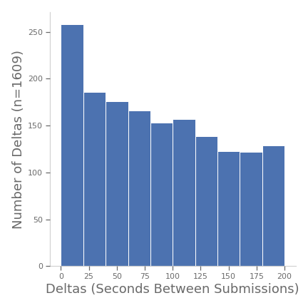
<Figure size 432x432 with 1 Axes>

These data show that the most frequently-occurring interval between submissions is 20 s or less. And it roughly follows an exponential decline, suggesting that post occurrences could be modeled as independent and randomly occurring events.

# Who posts?

A total of 1992 submission authors are represented in the data. The plot below shows a histogram of the authors ranked from most to lease posts. Note the vast majority of posters only posted once during the time period. Conversely, a minority of posters contributed 6 or more posts.

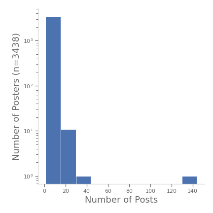
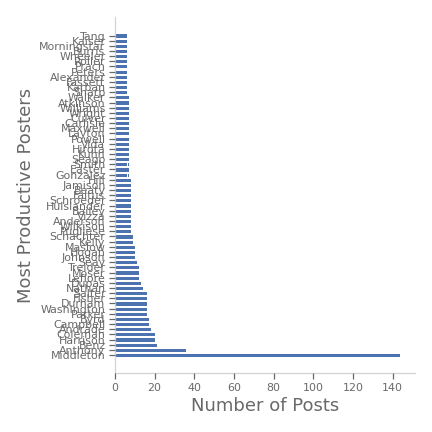
<Figure size 432x432 with 1 Axes><Figure size 432x432 with 1 Axes><Figure size 432x432 with 1 Axes>


# What relationships exist between Reddit's various post-popularity metrics?

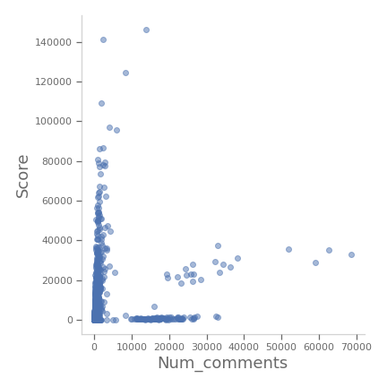
<Figure size 432x432 with 1 Axes>

These figures show the relationship between a submission's score and the number of comments it's received. The figure seems to show three clusters of data points. For now, let's focus on those happening in scores less than 2000, as this seems to be the majority of submissions (84%) and it looks like there might be a postive correlation between the two.


<Figure size 432x432 with 1 Axes>
The relationship between score and upvote ratio is a monotonicly incresing, negatively accelerated function.

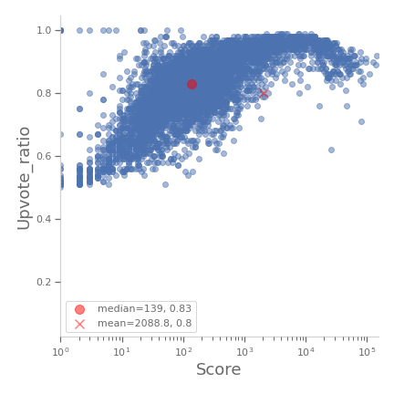
<Figure size 432x432 with 1 Axes>
Interestingly, the relationship between upvote ratio and score is bitonic, which is to say that score and upvote ratio increase together and then at some point, that relationship reverses: For example, posts with the most up votes are likely to have a higher proportion of down votes than posts with only somewhat fewer upvotes. Perhaps posts that attract the most upvotes are exceptionally controversial, and therefore likely to obtain proportionally fewer votes than slightly less popular posts. Or maybe, as posts become more popular, they attract more dissenters and contrarians.


# What makes for a popular post?
Here, I was interesting in two questions that felt intuitively likely:
1. Are older posts more popular?
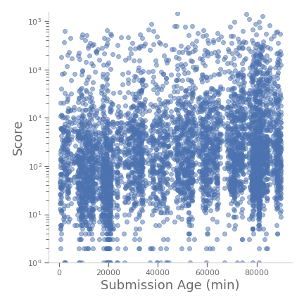
<Figure size 432x432 with 1 Axes>
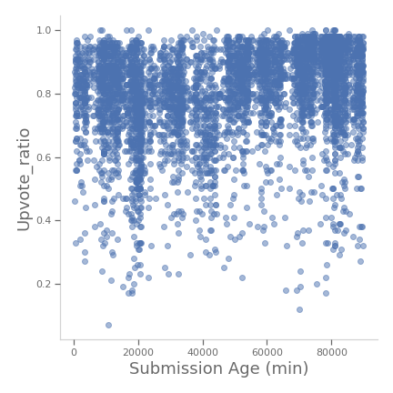
<Figure size 432x432 with 1 Axes>
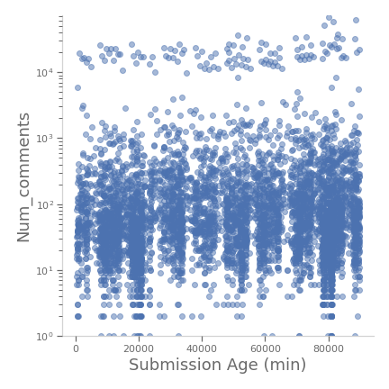
<Figure size 432x432 with 1 Axes>

1. Are posts by more frequently posters more popular?
spearman_rho=0.8288774913827227   spearman_p=0.0
pearson_r=0.5950497757068958   pearson_p=4.055607323151791e-149
spearman_rho=0.8946729719713885   spearman_p=9.977606973328821e-30
pearson_r=0.4096320487439156   pearson_p=0.00013261161695326073
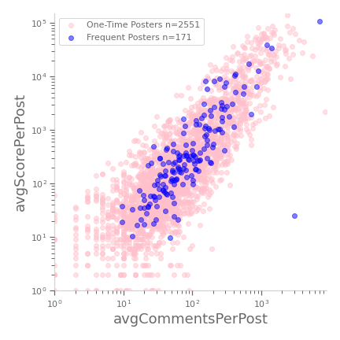
<Figure size 432x432 with 1 Axes>


No.

1. Stocks are sometimes written in capital letters in the middle of a word
1. Stocks are sometimes written beginning with a $ and ending with a space
1. Only one of the big authors is a bot (AutoModerator) as determined by visual inspection of their posts.

# Results Summary
For this analysis, I focused on four questions:
### 1. When do people post?
On most days, there are between 0 and 14 posts per hour, with most posts happening in the hour before the close of trading in US markets (4-5pm EST).
### 2. Who posts?
Most posters created only one post during the obversaion window, with only a minority of posters creating more than 6 posts.
### 3. What relationships exist between Reddit's various post-popularity metrics?
Most of Reddit's post-popularity metrics are positively correlated and monotonic, with an exception being the relaltionship between upvote ratio and score.
### 4. What makes for a popular post?
Two of the most intuitively likely candidates (post age and the productivity of the poster) had no clear reltaionship with post productivity.

# Future Directions

# Posts Per Hour


# Analysis of Submission Post Times


# Submission Impact EDA
There seem to be at least three measures related to the impact of each submission:
1. Score - This is similar to likes or upvotes on other social media platforms
1. Number of Comments - The most people are commenting on a post, the more exposure it's received and likely to receive in the future
1. Upvote Ratio - The proportion of upvotes to the total number of votes


<Figure size 432x432 with 1 Axes>

One might assume that older submissions tend to have more upvotes and hence, a higher score. However, no obvious relationship exists between score and submission age. Still, we can use this figure to examine the distribution of scores. Given the right-tailed skew, let's examine the distribution on a log axis.


<Figure size 432x432 with 1 Axes>


<Figure size 432x432 with 1 Axes>


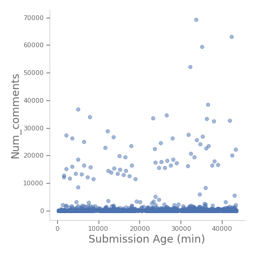
<Figure size 432x432 with 1 Axes>


<Figure size 432x432 with 1 Axes>

# Impact Relationships

## Score vs Num Comments


<Figure size 432x432 with 1 Axes>


<Figure size 432x432 with 1 Axes>

Excluding scores greater than 2000, we can see a clear positive relationship between score and the number of comments. This relationship can be see even more clearly when the data are plotted in log-log coordinates:

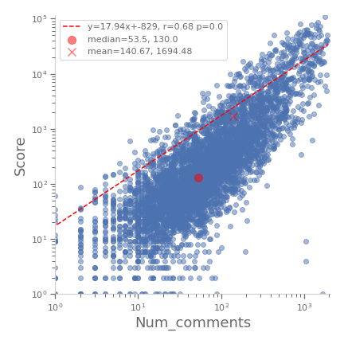
<Figure size 432x432 with 1 Axes>

And adding in the entire range of data, we can see the effect of the previously excluded data is negligable on that relationhip:


<Figure size 432x432 with 1 Axes>


## Upvote Ratio vs. Num Comments

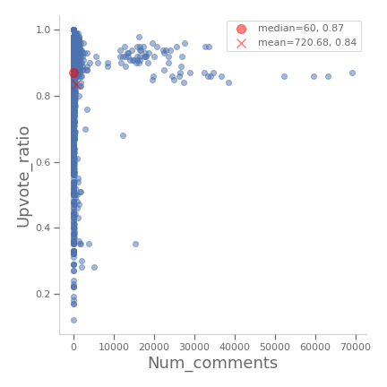
<Figure size 432x432 with 1 Axes>


<Figure size 432x432 with 1 Axes>


## Upvote Ratio vs. Score

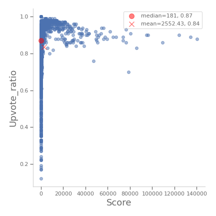
<Figure size 432x432 with 1 Axes>

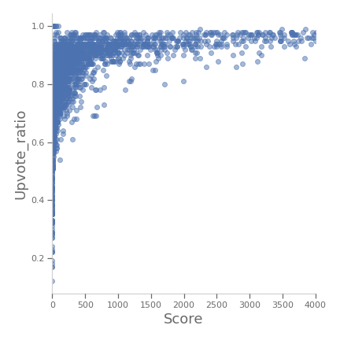
<Figure size 432x432 with 1 Axes>


# Next Steps
FIT THE DATA TO AN EXPONENTIAL DISTRIBUTION (or, geometric???)

Find the mentions of stocks and plot them across time

What makes a 'good' post?
What's the best time to post to get seen? Does this question differ if the 'judgement' of the post is negative or positive? I.e., is there a time to post that is associated with a greater likelihood of getting upvotes as opposed to getting either an upvote or a down vote?

Does reputation matter?
What's the average exposure, average upvote ratio for all posters versus the most productive posters? Are there statistically significant differences in those compared to average and between posters?
1. update the score and upvote ratio for existing submissions
1. what about number of comments?


# Technology Stack
1. Python
1. Jupyter Labs (pda/eda)
1. WSBScraper/MongoDB/Docker (backend)
1. Matplotlib/Seaborn (visualization)
1. PWeave (CI/CD: this readme)

_This file was compiled on 2021-04-17._
